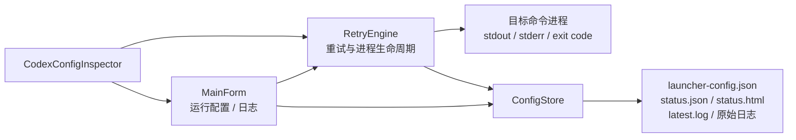

# Codex Relay 精简版重构设计

> 文档状态：待实施  
> 基于版本：2.6.0  
> 建议目标版本：3.0.0  
> 本文只定义重构方案，当前不修改现有程序功能。

## 1. 背景

当前 Codex Relay 同时承担命令重试、Codex 会话管理、邮件通知、计划任务和 API 纯净度检测等职责。功能之间存在较多交叉依赖，导致主界面、配置模型、重试引擎和发布目录逐渐复杂。

本次重构将程序收敛为一个专注的 Windows 命令重试工具：在指定工作目录执行命令，失败后按间隔重试，成功后停止，并提供实时状态和日志。

## 2. 重构目标

删除以下功能及其底层实现：

1. API 纯净度检测。
2. 邮箱发送与 Resend 配置。
3. Codex 会话扫描、占用判断、归档和失败会话清理。
4. 续接历史 Codex 对话。
5. Windows 计划任务管理。

保留以下核心能力：

- 在用户选择的工作目录中执行任意命令。
- 配置重试间隔和最大尝试次数，`0` 表示无限重试。
- 实时显示尝试次数、高负载次数、运行时间和最后退出码。
- 实时捕获标准输出与标准错误。
- 成功、警告和错误日志分色显示。
- 折叠界面中的大段 `403 + HTML`，完整内容继续写入原始日志。
- 停止当前进程及其子进程树。
- 成功后播放桌面提示音和闪烁窗口。
- 可选打开本地状态面板。
- 读取当前 Codex `config.toml` 的 `base_url`，继续提供允许 URL 校验。
- 保存运行配置、状态文件和原始日志。
- 保留 `--headless` 无界面运行方式。

## 3. 明确取消的行为

| 原行为 | 重构后行为 |
|---|---|
| “API 纯净度”标签页 | 完全移除，不再启动 Python 检测器 |
| “邮件通知”标签页 | 完全移除，不再读取、保存或发送 Resend 请求 |
| “计划任务”标签页 | 完全移除，不再调用 `schtasks.exe` |
| “新建会话/续接历史会话”切换 | 完全移除 |
| 历史会话选择窗口 | 完全移除 |
| 扫描 `~/.codex/sessions` | 完全移除 |
| 检查会话是否被 Codex App 占用 | 完全移除 |
| 自动取消归档历史会话 | 完全移除 |
| 失败后删除 Codex 会话文件 | 完全移除 |
| 从命令输出提取 `session id` | 完全移除 |

重构后，程序把 `codex exec` 与其他命令一样视为普通子进程。Codex CLI 是否创建会话、会话存放位置以及后续如何管理，均由 Codex CLI 和 Codex App 自行负责。

## 4. 目标架构



目标结构只保留四类职责：

- `MainForm`：界面输入、状态展示和日志查看。
- `RetryEngine`：执行、重试、停止和成功判定。
- `ConfigStore`：配置、状态和日志持久化。
- `CodexConfigInspector`：当前 Codex Base URL 读取与白名单校验。

## 5. UI 设计

### 5.1 顶部状态区

继续保留：

- 当前状态标题。
- 尝试次数。
- 高负载次数。
- 运行时间。
- 最后退出码。
- 查看日志按钮。

### 5.2 页面导航

原来的五个标签页缩减为两个：

```text
运行配置 | 日志
```

删除：

- 邮件通知。
- 计划任务。
- API 纯净度。

### 5.3 运行配置页

保留以下区域：

1. **执行命令**
   - 多行命令文本框。
   - 默认命令仍可使用 `codex exec --skip-git-repo-check ...`。

2. **工作目录**
   - 工作目录文本框。
   - “选择”按钮。
   - 继续使用程序内 `DirectoryPickerForm`，避免系统 Shell 文件夹对话框卡死。

3. **重试参数**
   - 重试间隔秒数。
   - 最大尝试次数。
   - 允许的 Base URL。
   - “同步当前 URL”按钮。

4. **成功动作**
   - 成功后桌面提醒。
   - 成功后打开本地网页状态面板。

删除以下控件：

- 新建会话按钮。
- 续接历史会话按钮。
- 选择会话按钮。
- 历史会话摘要和占用提示。
- 续接提示词文本框。
- “请求失败自动删除会话”复选框。
- 所有邮件配置控件。
- 所有计划任务配置控件。

### 5.4 日志页

日志页维持现有实现：

- 独立大尺寸日志框。
- 错误红色、警告黄色、成功绿色。
- 自动滚动。
- 清空历史日志。
- 打开日志目录。
- 内存日志有容量上限，原始日志保留完整内容。

## 6. 配置模型调整

### 6.1 精简后的 `LauncherConfig`

```csharp
public sealed class LauncherConfig
{
    public string Command { get; set; } =
        "codex exec --skip-git-repo-check 你好，请回复连接测试成功";

    public string WorkDir { get; set; } =
        AppContext.BaseDirectory.TrimEnd(Path.DirectorySeparatorChar);

    public int Interval { get; set; } = 10;
    public int MaxTries { get; set; }
    public bool Notify { get; set; } = true;
    public bool OpenDashboard { get; set; }
    public string AllowedBaseUrls { get; set; } = "https://api.openai.com/v1";
}
```

删除字段：

- `SessionMode`
- `ResumeSessionId`
- `ResumePrompt`
- `AllowLikelyActiveResumeSession`
- `NewSessionWorkDir`
- `DeleteFailedSessions`
- `TaskName`
- `DailyAt`
- `EmailEnabled`
- `EmailApiUrl`
- `EmailDomain`
- `EmailFromName`
- `RandomizeEmailAddresses`
- `EmailFromLocalPart`
- `EmailToLocalPart`
- `KeyPurity`

### 6.2 精简后的 `LauncherStatus`

保留：

- `RunId`
- `Pid`
- `Status`
- `Phase`
- `Message`
- `Command`
- `WorkDir`
- `LogFile`
- `LatestLog`
- `Attempt`
- `HighDemandCount`
- `MaxTries`
- `IntervalSeconds`
- `ProgressPercent`
- `LastExitCode`
- `LastErrorSnippet`
- `ResultPreview`
- `StartedAt`
- `UpdatedAt`
- `ElapsedSeconds`
- `ElapsedText`
- `IsRunning`

删除：

- `SessionMode`
- `SessionId`
- `EmailNotificationStatus`
- `EmailNotificationMessage`
- `EmailFrom`
- `EmailTo`
- `EmailId`

`CommandResult` 同时删除 `SessionId` 参数，只保留退出码、标准输出和标准错误。

## 7. 源码删除清单

实施时删除以下文件或目录：

### 7.1 API 纯净度

- `KeyPurityModels.cs`
- `KeyPurityDetectorService.cs`
- `KeyPurityPage.cs`
- `CodexCredentialProvider.cs`
- `detector/`

### 7.2 邮件通知

- `EmailNotificationService.cs`
- `SecretStore.cs`

### 7.3 会话管理与续接

- `CodexSessionCatalog.cs`
- `CodexSessionCleaner.cs`
- `CodexSessionPickerForm.cs`
- `CodexCommandBuilder.cs`

### 7.4 计划任务

- `TaskSchedulerService.cs`

### 7.5 不再需要的文件选择器

- `LocalFilePickerForm.cs`

`LocalFilePickerForm` 当前只服务于邮件 Key 导入和纯净度报告加载；两个功能删除后不再有调用方。`DirectoryPickerForm.cs` 继续保留，用于选择工作目录。

## 8. 需要修改的文件

### 8.1 `Program.cs`

删除：

- `TryImportEmailApiKeyFromAncestors()`。
- `ResendEmailNotifier` 创建。
- 向 `RetryEngine` 和 `MainForm` 注入邮件服务。

目标初始化流程：

```csharp
var store = new ConfigStore(AppContext.BaseDirectory);
var engine = new RetryEngine(store);
```

### 8.2 `MainForm.cs`

删除：

- 邮件、计划任务、纯净度页面及其控件。
- 会话模式、历史会话选择和会话占用逻辑。
- 邮件 Key 导入、测试邮件及预览逻辑。
- 计划任务安装、删除和刷新逻辑。
- 关闭窗口时对纯净度检测状态的检查。

保留并整理：

- 运行页。
- 日志页。
- 顶部实时状态区。
- 开始、停止、保存、目录选择和 Base URL 同步。

### 8.3 `RetryEngine.cs`

删除：

- `ISuccessEmailNotifier` 字段与构造参数。
- 邮件发送和邮件状态更新。
- `CodexCommandBuilder.Resolve()`。
- 历史会话校验、占用判断和取消归档。
- Session ID 捕获。
- 失败会话删除。

命令直接取自：

```csharp
var executionCommand = config.Command.Trim();
```

重试循环只负责：

1. 校验配置。
2. 启动命令。
3. 捕获输出。
4. 更新状态。
5. 判断成功或等待下一次尝试。

### 8.4 `ConfigStore.cs`

删除：

- `EmailSecretStore`。
- Resend Key 读取、写入和导入方法。
- 自动向上查找 `邮箱发送请求格式.txt`。
- 状态面板中的邮件状态行。
- 加载配置时对 `KeyPurity` 的补值。

保留原子写入、日志目录、状态 JSON 和状态 HTML。

### 8.5 `CodexConfigInspector.cs`

保留该文件，但去掉对 `SessionMode` 的判断。Base URL 校验条件调整为：只有当前命令以 `codex` 开头时才检查当前 Codex provider 的 `base_url`。

### 8.6 项目文件

从 `CodexLauncher.Rebuild.csproj` 删除：

```xml
<ItemGroup>
  <Content Include="detector\**\*">
    <CopyToOutputDirectory>PreserveNewest</CopyToOutputDirectory>
    <CopyToPublishDirectory>PreserveNewest</CopyToPublishDirectory>
    <ExcludeFromSingleFile>true</ExcludeFromSingleFile>
  </Content>
</ItemGroup>
```

删除后发布包不再携带 Python 文件，也不再要求用户安装 Python。

## 9. 运行流程

```text
用户点击开始
  ↓
读取并校验命令、工作目录、间隔和次数
  ↓
如果是 Codex 命令，校验当前 Base URL
  ↓
清空本轮实时计数
  ↓
在指定目录启动子进程
  ↓
实时读取 stdout / stderr 并写入日志
  ↓
退出码为 0 且 stdout 存在有效回复？
  ├─ 是：标记成功，执行桌面提醒/打开状态页
  └─ 否：等待间隔后重新启动命令
```

这里不再出现会话扫描、Session ID 解析、会话删除、邮件发送或计划任务操作。

## 10. 旧配置迁移

`System.Text.Json` 默认会忽略旧 JSON 中已经不存在的字段，因此旧版 `launcher-config.json` 可以直接读取。

首次保存配置后，旧字段自然从新配置文件中消失。迁移过程应满足：

- 保留旧配置中的 `Command`。
- 工作目录优先使用旧 `WorkDir`；如果为空，可兼容读取一次旧 `NewSessionWorkDir`。
- 保留 `Interval`、`MaxTries`、`Notify`、`OpenDashboard` 和 `AllowedBaseUrls`。
- 忽略会话、邮件、计划任务和纯净度字段。
- 不因旧字段存在而提示配置损坏。

建议在 `LoadConfig()` 中加入一次兼容迁移，而不是要求用户手工删除旧配置。

## 11. 历史数据处理

重构过程不自动删除以下用户数据：

- `logs/resend-key.dat`
- `logs/detector/` 中的检测报告和日志
- 程序目录中旧的 `detector/`
- `~/.codex/sessions`
- `~/.codex/archived_sessions`
- Windows 中已经安装的旧计划任务

原因是这些数据可能仍有审计或恢复价值。新版本只停止读取和写入它们。

发布目录的全新安装包不再包含 `detector/`。如果是在现有 `dist` 上覆盖升级，应在发布脚本中明确区分：

- 程序自带的旧 `dist/detector/` 可以从新版分发目录移除。
- `dist/logs/detector/` 属于用户运行数据，继续保留。
- 已安装的 Windows 计划任务不会由新版自动运行管理；如需清理，应由用户确认后单独执行。

## 12. 测试调整

删除以下测试组：

- API 纯净度界面、命令参数、报告解析、自检和进程生命周期。
- Codex 会话目录扫描、去重、归档、续接和失败会话删除。
- 邮件默认配置、Resend 请求、重试、DPAPI 和邮件取消。
- 计划任务安装与状态检查。

保留并加强以下测试：

1. 主界面只有“运行配置”和“日志”两个标签页。
2. 文本框和按钮没有遮挡。
3. 工作目录选择器正常工作。
4. 启动一次尝试只创建一个子进程。
5. 命令确实在所选目录运行。
6. 尝试次数、时间和退出码实时更新。
7. 新任务和 Base URL 切换会清空计数。
8. 成功、错误和停止状态判定正确。
9. 403 HTML 在界面折叠、原始日志完整保存。
10. 日志敏感信息脱敏。
11. ERROR 为红色，普通 stderr 为黄色。
12. 卡在关闭阶段的 Codex 进程可以超时结束并继续重试。
13. `--headless` 成功返回 `0`，失败返回非零。
14. 旧版配置可以迁移到精简模型。

目标是将现有 37 项测试替换为约 20–24 项聚焦核心重试能力的测试。

## 13. 实施顺序

建议按以下顺序实施，保证每一步都能编译：

1. 为当前 2.6.0 源码和 `dist` 建立备份或版本标签。
2. 精简 `Models.cs`，增加旧配置迁移测试。
3. 从 `RetryEngine` 删除邮件和会话逻辑。
4. 简化 `Program.cs` 的依赖创建。
5. 重构 `MainForm`，只保留运行配置和日志。
6. 精简 `ConfigStore` 和状态 HTML。
7. 调整 `CodexConfigInspector`。
8. 删除不再使用的源码文件和 `detector/` 内容引用。
9. 重写冒烟测试。
10. 构建、测试和发布 3.0.0。
11. 在干净目录和旧版覆盖升级两种场景下分别验收。

## 14. 验收标准

满足以下条件才视为重构完成：

- 主界面只存在“运行配置”和“日志”。
- EXE 启动后不加载 Python、不扫描 Codex 会话目录、不读取 Resend Key、不调用 `schtasks.exe`。
- 发布目录不包含 `detector/`。
- 程序不引用已删除的邮件、会话、纯净度和计划任务类型。
- 旧配置能够自动迁移，核心运行参数不丢失。
- 开始、停止、自动重试、成功判定和实时指标正常。
- 工作目录选择器不会卡死。
- 日志高亮、HTML 折叠、敏感信息脱敏和原始日志保存正常。
- GUI 与 `--headless` 模式均通过测试。
- Release 构建为 0 警告、0 错误。

## 15. 预期结果

完成后，Codex Relay 将从多模块管理工具精简为单一职责的连接重试器：

```text
配置命令 → 选择目录 → 开始重试 → 查看实时状态和日志 → 成功后停止
```

预期收益：

- 界面更简单。
- 启动速度更快。
- 发布包更小。
- 不再依赖 Python。
- 配置项明显减少。
- 重试引擎与外部服务解耦。
- 后续维护和排查更直接。
